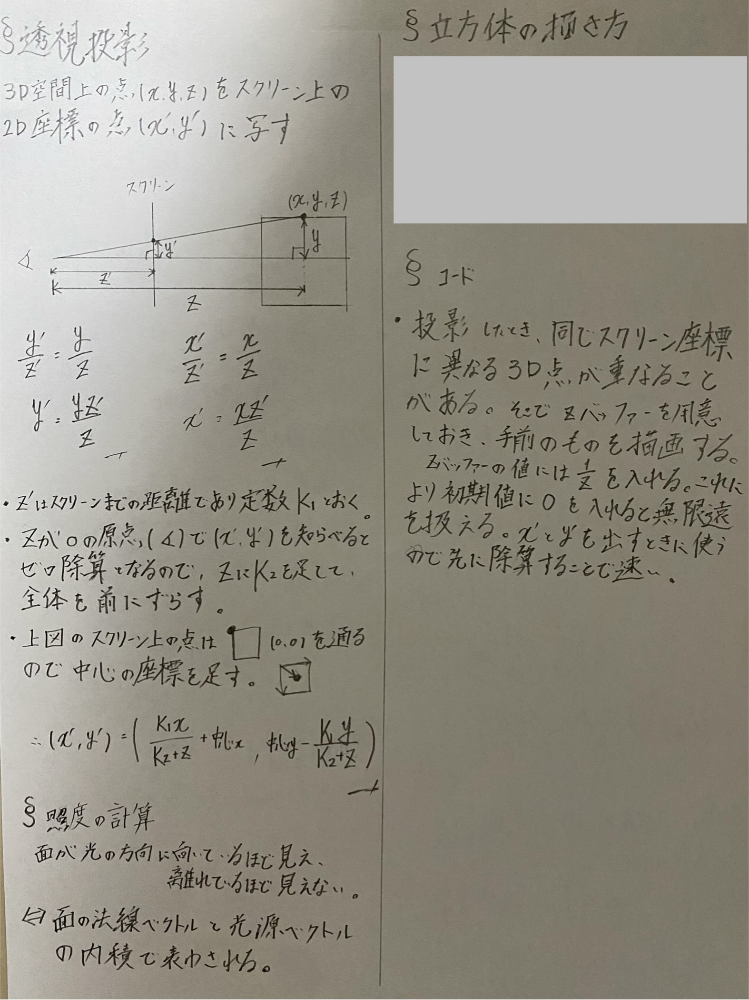

# rotate

I found a famous code that shows a rotating donut. It was written in C, so I rewrote it in Dart, which I use the most these days. I also changed the code to make a rotating cube instead of a donut.

